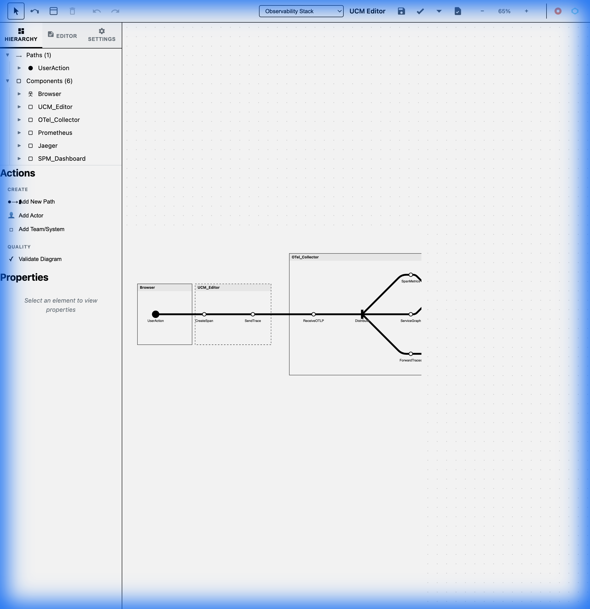

# UCM Editor

A powerful, browser-based editor for **Use Case Maps (UCM)**, implementing the [ITU-T Z.151](https://www.itu.int/rec/T-REC-Z.151) standard with a modern, "London Tube Map" inspired visualization.

## Visual Tour

### Interactive Diagram Editing
Visualize complex scenarios with clear, high-contrast paths and components. The editor supports drag-and-drop manipulation, path tracing, and real-time updates.



### Live DSL Editor
Define your diagrams declaratively using our simple, readable DSL. The editor provides two-way synchronization between the visual graph and the code.


### Customizable Settings
Tailor the visual experience with options for grid display, transit map mode, and rendering styles.


## Overview
This project aligns with the "Path-Centric" philosophy where the system is modeled as an abstract network graph of Components (containers) and Responsibilities (nodes) connected by Paths (edges).

## Features
-   **Declarative Syntax**: Simple DSL to define components, paths, and responsibilities.
-   **Modern Aesthetics**: High-contrast "Transit Map" styling for readability.
-   **Dual Editing**: Edit via the visual canvas or the DSL code editor.
-   **Hierarchy View**: Navigate complex nested structures easily.
-   **Export Options**: Export to SVG, JSON, and other formats.
-   **Local Observability**: Integrated with Jaeger and Prometheus for tracing experimentation (requires local setup).

## Getting Started

### 🌐 Live Demo
Try the UCM Editor online: **[https://devrimdemiroz.github.io/ucm-js/](https://devrimdemiroz.github.io/ucm-js/)**

No installation required! The editor runs entirely in your browser.

### Local Development

#### Prerequisites
-   A modern web browser (Chrome, Firefox, Safari).
-   Node.js (optional, for running the development server).

#### Installation & Running
1.  Clone this repository:
    ```bash
    git clone https://github.com/devrimdemiroz/ucm-js.git
    cd ucm-js
    ```

2.  Start a local web server:
    ```bash
    # Using Node.js
    npx http-server .

    # Or using Python
    python3 -m http.server 8080
    ```

3.  Open your browser to `http://localhost:8080`

#### Deployment
The project automatically deploys to GitHub Pages on every push to the `main` branch. The deployment workflow is defined in `.github/workflows/deploy.yml`.

## Syntax Guide

The UCM syntax is intuitive and human-readable.

```text
ucm
component "Authentication System"
component "Database"

path "Login Flow" 
    start "User" 
    end "Database" 
    responsibility "Check Creds"
```

*   **`component`**: Defines a container (actor, system, object).
*   **`path`**: Defines a causal path with start and end points.
*   **`responsibility`**: Defines an action or step along the path (X).
*   **`fork/join`**: (Supported via advanced syntax) Define branching logic.

## Architecture
-   **`graph.js`**: Core graph data structure.
-   **`parser.js`**: DSL parser converting text to graph objects.
-   **`renderer.js`**: D3.js based rendering engine.
-   **`app.js`**: Main application controller.

## References
-   **Standards**: ITU-T Z.151
-   **Inspiration**: jUCMNav
