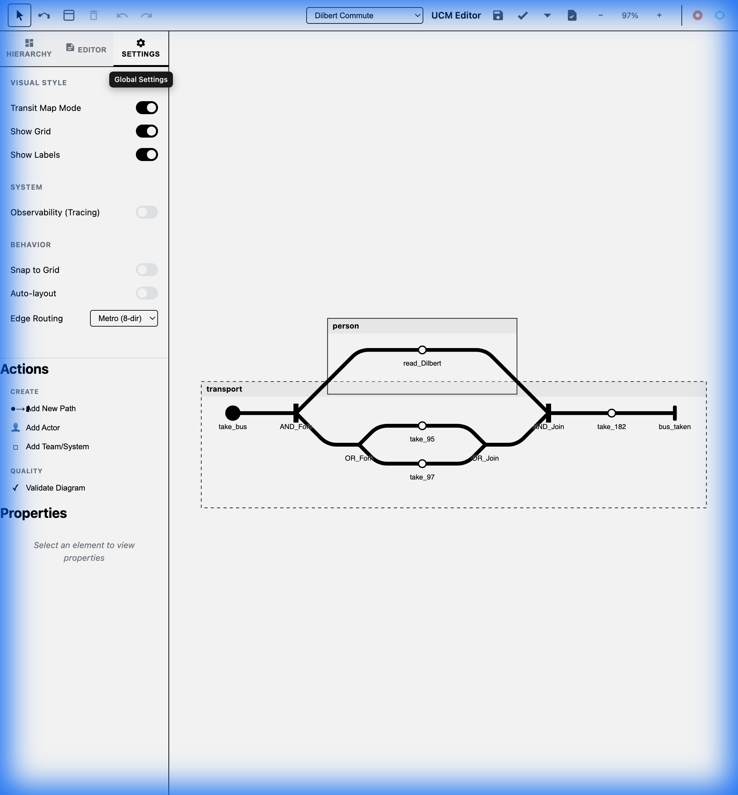
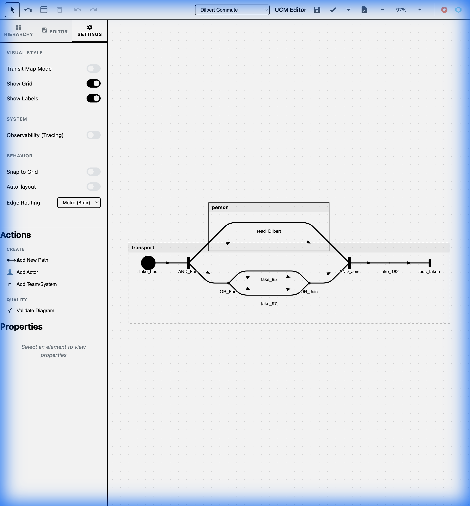
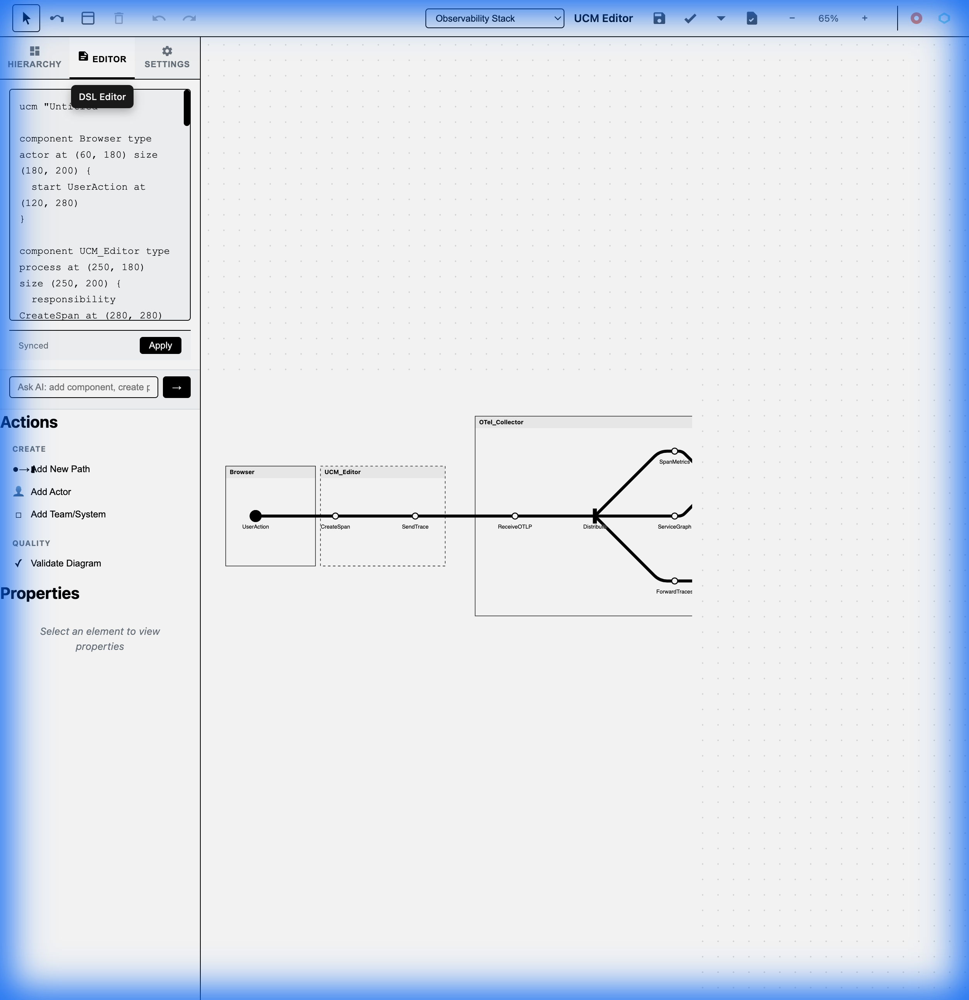
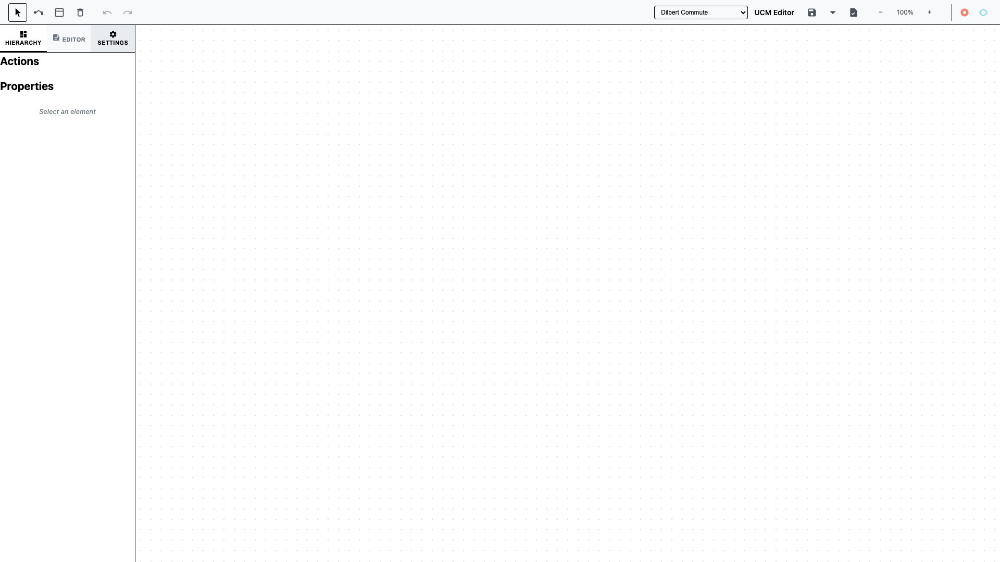

# UCM Editor

A powerful, browser-based editor for **Use Case Maps (UCM)**, implementing the [ITU-T Z.151](https://www.itu.int/rec/T-REC-Z.151) standard with a modern, "London Tube Map" inspired visualization.

## 🌐 Live Demo
Try the UCM Editor online: **[https://devrimdemiroz.github.io/ucm-js/](https://devrimdemiroz.github.io/ucm-js/)**

No installation required! The editor runs entirely in your browser.

---

## Visual Tour
 
 ### Interactive Diagram Editing
 Visualize complex scenarios with clear, high-contrast paths and components. The editor supports drag-and-drop manipulation, path tracing, and real-time updates.
 
 **Transit Map Mode (Default)**
 
 
 **Classic UCM Style**
 
 
 ### Live DSL Editor
 Define your diagrams declaratively using our simple, readable DSL. The editor provides two-way synchronization between the visual graph and the code.
 
 
 
 ### Customizable Settings
 Tailor the visual experience with options for grid display, transit map mode, and routing styles.
 
 

---

## Features

| Feature | Description |
|---------|-------------|
| **Declarative DSL** | Simple syntax to define components, paths, and responsibilities |
| **Modern Aesthetics** | High-contrast "Transit Map" styling for readability |
| **Dual Editing** | Edit via the visual canvas OR the DSL code editor |
| **Hierarchy View** | Navigate complex nested structures easily |
| **Export Options** | Export to SVG, PNG, JSON, D3.js, Cytoscape.js formats |
| **Keyboard Shortcuts** | Full keyboard support (Ctrl+Z, Delete, Arrow keys, etc) |
| **Validation** | Built-in graph validator catches structural issues |
| **Observability** | Optional Jaeger/Prometheus integration for tracing |

---

## Getting Started

### Local Development

#### Prerequisites
- A modern web browser (Chrome, Firefox, Safari)
- Node.js (optional, for running the development server)

#### Installation & Running
1. Clone this repository:
   ```bash
   git clone https://github.com/devrimdemiroz/ucm-js.git
   cd ucm-js
   ```

2. Start a local web server:
   ```bash
   # Using Node.js
   npx http-server . -p 8080

   # Or using Python
   python3 -m http.server 8080
   ```

3. Open your browser to `http://localhost:8080`

---

## DSL Syntax Guide

The UCM syntax is intuitive and human-readable:

```text
ucm "My Diagram"

component "Authentication" type team at (50, 50) size (400, 300) {
  start "Login" at (100, 100)
  responsibility "Validate" at (200, 100)
  end "Success" at (300, 100)
}

link "Login" -> "Validate"
link "Validate" -> "Success"
```

### Keywords
- **`ucm`** - Diagram name declaration
- **`component`** - Container (team, actor, system, object)
- **`start/end`** - Path endpoints
- **`responsibility`** - Action/step along the path
- **`fork/join`** - Branching logic
- **`link`** - Edge connection between nodes

---

## Keyboard Shortcuts

| Shortcut | Action |
|----------|--------|
| `Ctrl/⌘ + Z` | Undo |
| `Ctrl/⌘ + Shift + Z` | Redo |
| `Ctrl/⌘ + S` | Save (download JSON) |
| `Delete/Backspace` | Delete selected |
| `Ctrl/⌘ + A` | Select all |
| `Ctrl/⌘ + D` | Duplicate selected |
| `Arrow keys` | Move selected (1px, +Shift: 10px) |
| `V` | Select tool |
| `P` | Path tool |
| `C` | Component tool |
| `Escape` | Deselect all |

---

## Architecture

| Module | Purpose |
|--------|---------|
| `js/core/graph.js` | Core graph data structure with CRUD & events |
| `js/core/parser.js` | DSL parser converting text to graph |
| `js/core/serializer.js` | Graph to DSL serialization |
| `js/core/validator.js` | Structural validation (start/end, fork/join) |
| `js/core/exporter.js` | Multi-format export (SVG, PNG, JSON, etc) |
| `js/editor/canvas.js` | SVG rendering engine |
| `js/ui/keyboard.js` | Keyboard shortcut manager |

---

## References
- **Standards**: [ITU-T Z.151](https://www.itu.int/rec/T-REC-Z.151)
- **Inspiration**: [jUCMNav](https://jucmnav.softwareengineering.ca/)

---

**Last Updated**: 2026-01-05
